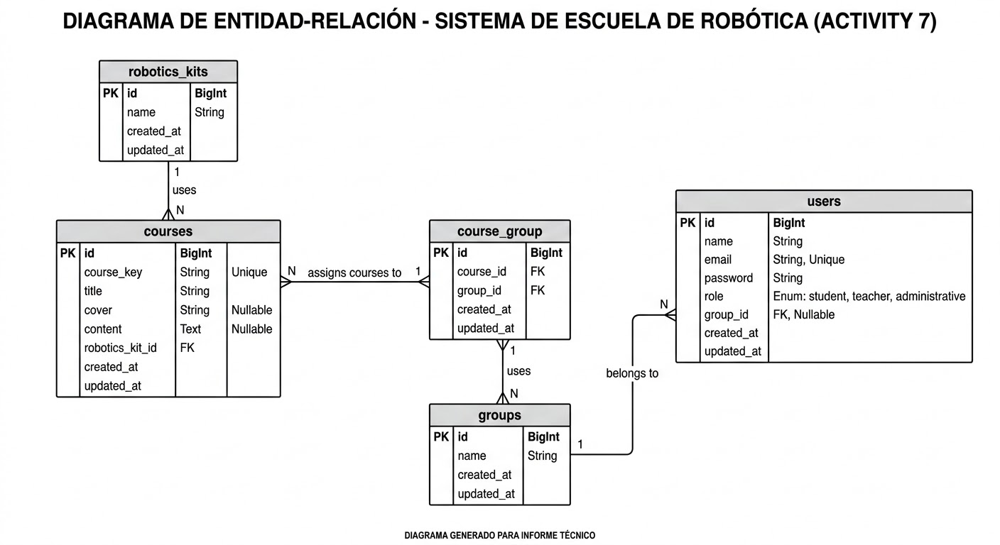

# Robotics School System - Activity 7 & 8

## Project Description
This project is a web application designed for a small robotics school. It allows the administration of courses, robotics kits, and different types of users (students, teachers, and administrative staff) using Eloquent ORM and MySQL. 

## ER Diagram
